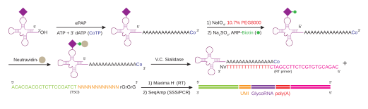

# rPAL-seq
Pipeline for glycoRNA sequencing and analysis

## Overview
This repository contains scripts, reference data and example workflow to reproduce the computational analysis and figures from [Ge, R. et al.](https://doi.org/xx.xxxx).
rPAL-seq profiles sialoglycoRNA ([Flynn, R.A. et al. *Cell*, 2021](https://doi.org/10.1016/j.cell.2021.04.023)) through chemical conversion, glycan-specific catch and release, followed by optimized small ncRNA library construction (Fig. 1) and a computational analysis pipeline (Fig. 2).

## Dependencies
These softwares/packages are required:
- `python3` 3.12.2  
- `R` 4.3.3  
- `cutadapt` 4.9  
- `bowtie2` 2.5.4  
- `samtools` 1.21  
- [`cpup` 0.1](https://github.com/y9c/cpup)

## Repository Structure
repo-root/
├── data/                   # reference files
│   ├── annotation/         # transcript-to-family CSVs
│   ├── manaz_families/     # curated family lists from Flynn, et al. 2021
│   └── transcriptome/      # curated FASTA reference
├── scripts/                # pipeline and analysis scripts
│   ├── workflow/           
│   │   ├── bash/           # preprocessing, alignment, run EM
│   │   └── python/         # EM posterior assignment
│   └── analysis/
│       └── R/              # figure generation, statistics
├── doc/                   # workflow diagrams, example output
├── LICENSE
└── README.md

## Usage
Use index-demultiplexed `fastq.gz` files as the input for `scripts/workflow`.  
The order of processing is documented in the [paper](https://doi.org/xx.xxxx) and illustrated in Fig. 2.  

Expected outputs are individual CSV files per library containing:  
1. EM-assigned transcript counts  
2. Per-base pileup results  

Example aggregated data (matrix from multiple samples) can be found under GEO accession `GSMXXXXXX`.

Use the CSV files from the first step as input for `scripts/analysis`. This identifies enriched hits by DESeq2, enriched mismatches by limma, and generates downstream statistics and plots.

Example volcano plots can be found in `doc`

## Workflow diagrams

<p align="center">
  
  <br/>
  <em>Figure 1. Optimized small ncRNA library construction. tRNA icon from BioRender.com.</em>
</p>

```mermaid
flowchart TD
    A["Raw FASTQ"] --> B["cutadapt\nTrim adapters; remove 3' poly(A/G);\nhandle 5' GGG; extract UMI"]
    B --> C["Bowtie2\nMap to ncRNA transcriptome; retain multi-mappings"]
    C --> D["em_dedup.py\nUMI grouping; EM to estimate alignment posteriors"]
    D --> E["Aggregate posterior-weighted fractional counts\ncounts_matrix"]
    D --> D2["Posterior-based BAM deduplication"]
    D2 --> F["samtools mpileup + cpup\nPer-base depth_matrix"]
    E --> G["DESeq2"]
    F --> H["Per-pair log-odds, precision weighted"]
    H --> J["limma + eBayes\n(moderated t-test)"]
    G --> I["Hit calling and post-hoc TP decision"]
    J --> K["Per base hit calling\n(total mismatch & skip/gap/indel share)"]
    subgraph rEF[ ]
      direction LR
      E
      F
    end
    subgraph rGJ[ ]
      direction LR
      G
      J
    end
    subgraph rIK[ ]
      direction LR
      I
      K
    end
    class rEF,rGJ,rIK n
    classDef n fill:none,stroke:none;
