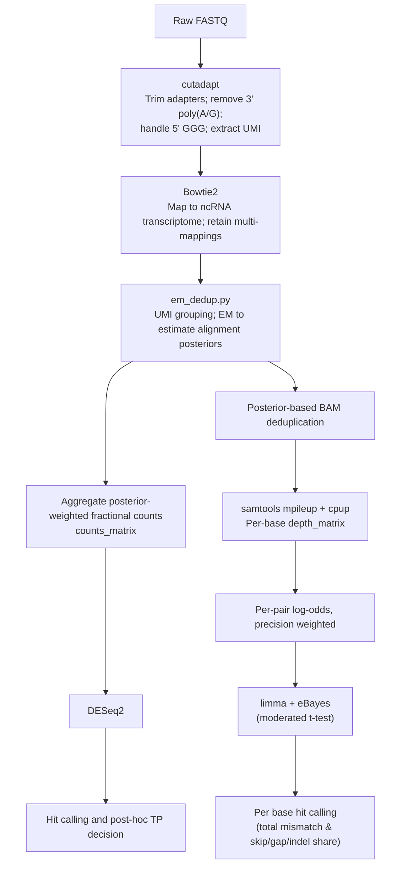

# rPAL-seq
Pipeline for glycoRNA sequencing and analysis

## Overview
This repository contains scripts, reference data and example workflow to reproduce the computational analysis and figures from [Ge, R. et al.](https://doi.org/10.1101/2025.10.04.680438).
rPAL-seq profiles sialoglycoRNA ([Flynn, R.A. et al. *Cell*, 2021](https://doi.org/10.1016/j.cell.2021.04.023)) through chemical conversion, glycan-specific catch and release, followed by optimized small ncRNA library construction (Fig. 1) and a computational analysis pipeline (Fig. 2).

## System requirements

### Software dependencies

Command-line tools:

| tool | version tested |
| --- | --- |
| `python3` | 3.12.2 |
| `R` | 4.3.3 |
| `cutadapt` | 4.9 |
| `bowtie2` | 2.5.4 |
| `samtools` | 1.21 |
| [`cpup`](https://github.com/y9c/cpup) | 0.1 |

R packages: `DESeq2` 1.42.1, `limma` 3.58.1, plus `dplyr`, `readr`, `tidyr`, `stringr`, `purrr`,
`tibble`, `ggplot2`, `ggrepel`, `scales`, `eulerr` and `ComplexUpset` for the plotting scripts.
Python: the standard library plus `pysam` for `umi_em_dedup.py`.

### Operating systems

Developed and run on Linux (x86_64) for the preprocessing steps and on macOS (Apple silicon) for the
R analysis steps. No Windows testing has been done; the bash workflow scripts assume a POSIX shell.
The versions above are the ones the published analysis was run with, not minimum requirements.

### Hardware

No non-standard hardware is required, but the two halves of the pipeline have very different
appetites.

**Preprocessing** (`scripts/workflow/`) is written for a cluster with a SLURM scheduler. The batch
scripts under `scripts/workflow/bash/slurm/` request, per job across a whole cohort:

| step | tasks x cpus | memory | walltime |
| --- | --- | --- | --- |
| `cutadapt_batch.sh` | 6 x 8 | 64 GB | 4 h |
| `bowtie2_batch.sh` | 4 x 8 | 32 GB | 8 h |
| `umi_em_count_batch.sh` | 4 x 2 | 64 GB | 12 h |
| `umi_em_bam_batch.sh` | 4 x 4 | 64 GB | 16 h |
| `cpup_batch.sh` | 4 x 1 | 32 GB | 8 h |

Those are the allocations the jobs request, not measured peak usage, and they cover several samples
running in parallel. A single sample needs roughly the memory divided by the task count. If you have
no scheduler, the worker scripts in `scripts/workflow/bash/worker/` are plain bash and run standalone
(see Installation), so a workstation with 8 or more cores and 32 GB of RAM can process samples
serially.

**Analysis** (`scripts/analysis/`) runs comfortably on a laptop. The worked example below completes in
about 12 seconds on an 8-core machine with 8 GB of RAM.

## Installation

There is nothing to compile and no package to install. Clone the repository and install the
dependencies listed above.

```bash
git clone https://github.com/FlynnLab/rPAL-seq.git
cd rPAL-seq
```

The dependencies are most easily obtained with conda/mamba:

```bash
conda create -n rpalseq -c conda-forge -c bioconda \
  python=3.12 r-base=4.3 cutadapt=4.9 bowtie2=2.5.4 samtools=1.21 pysam
conda activate rpalseq
Rscript -e 'if (!requireNamespace("BiocManager", quietly=TRUE)) install.packages("BiocManager", repos="https://cloud.r-project.org"); BiocManager::install(c("DESeq2","limma")); install.packages(c("dplyr","readr","tidyr","stringr","purrr","tibble","ggplot2","ggrepel","scales","eulerr","ComplexUpset"), repos="https://cloud.r-project.org")'
```

`cpup` is not on conda; install it from [its repository](https://github.com/y9c/cpup).

Typical install time on a normal desktop computer: about 5 minutes for the conda environment and 10
to 20 minutes for the R packages, dominated by compiling the Bioconductor dependencies. Cloning the
repository itself takes seconds.

## Demo

A worked example that reproduces the transcript-level glycoRNA calls for HeLa from publicly available
processed data. It exercises the analysis half of the pipeline and needs no cluster, no alignment
index and no FASTQ download.

### Get the demo data

The processed count matrix is a supplementary file of GEO accession
[GSE308686](https://www.ncbi.nlm.nih.gov/geo/query/acc.cgi?acc=GSE308686) and is 0.2 MB compressed:

```bash
mkdir -p demo_run && cd demo_run
curl -O https://ftp.ncbi.nlm.nih.gov/geo/series/GSE308nnn/GSE308686/suppl/GSE308686_count_matrix_homo.csv.gz
gunzip GSE308686_count_matrix_homo.csv.gz
cp ../demo/metadata_demo.csv .
```

`GSE308686_count_matrix_homo.csv` holds 2,317 transcripts across 196 libraries.
`demo/metadata_demo.csv` selects the four HeLa biological replicates (`VH1` to `VH4`); the scripts
append the `i`/`p`/`h` suffixes to reach the Input, IP and Control library of each replicate, so the
example runs on 12 of those 196 columns.

### Run it

Both scripts read their inputs from paths declared at the top of the file (see Instructions for use).
Point them at the demo files, then run from inside `demo_run`:

```bash
sed -e 's|/path/to/count_matrix.csv|GSE308686_count_matrix_homo.csv|' \
    -e 's|/path/to/metadata.csv|metadata_demo.csv|' \
    -e 's|/path/to/transcriptome/annotation.csv|../data/annotation/transcript2family_homo.csv|' \
    ../scripts/analysis/R/counts_analysis/deseq2_pairwise_lrrna_norm.R > step1.R

sed -e 's|/path/to/metadata.csv|metadata_demo.csv|' \
    ../scripts/analysis/R/counts_analysis/tp_wald_sizeadjust.R > step2.R

Rscript step1.R    # DESeq2 IP-vs-Input and Control-vs-Input, long-rRNA normalized
Rscript step2.R    # post hoc Wald test against the mock-release control
```

### Expected output

```
deseq2_results_pI_HeLa.csv    IP vs Input contrast
deseq2_results_cI_HeLa.csv    Control vs Input contrast
wald_all_HeLa.csv             every transcript with both contrasts and the delta statistic
wald_dir_HeLa.csv             the directional subset (log2FC IP/Input > 0.5)
wald_TP_HeLa.csv              216 true-positive glycoRNA calls
```

`wald_TP_HeLa.csv` carries 216 rows and 21 columns. The strongest calls are small nuclear and
nucleolar RNAs and a pre-miRNA, for example `snRNA_LOC124906135_29211` at log2FC 2.96, matching the
biotype composition of the example volcano in `doc/volcano_tp_example.png`.

### Expected run time

About 10 to 12 seconds total: 7 to 9 seconds for `step1.R` and about 3 seconds for `step2.R`, over two
runs on an 8-core Apple M3 with 8 GB of RAM under macOS 14.2. That measurement used R 4.6.0 with DESeq2 1.52.0
and limma 3.68.3 rather than the pinned versions above; the timing is not sensitive to the difference,
but exact numeric output can shift slightly between DESeq2 releases.

To exercise the per-base variant arm as well, `GSE308686_counts_long.csv.gz` from the same accession
is the corresponding input for `scripts/analysis/R/variant_analysis/`. It is 117 MB compressed and so
is not part of the quick demo.

## Repository Structure
```text
repo-root/
├── data/                   # reference files
│   ├── annotation/         # transcript-to-family CSVs
│   ├── manaz_families/     # curated family lists
│   └── transcriptome/      # curated FASTA reference, and the spike-in references
├── scripts/                # pipeline and analysis scripts
│   ├── workflow/           
│   │   ├── bash/           # preprocessing, alignment, run EM
│   │   └── python/         # EM posterior assignment
│   ├── analysis/
│   │   └── R/              # figure generation, statistics
│   └── revision/           # analyses added during peer review, with their input tables
│       ├── em_benchmark/       # read-assignment benchmark
│       ├── spike_titration/    # synthetic sialoglycoRNA standard, dose-response
│       ├── coverage/           # 5' coverage retention
│       └── classification/     # ROC / LOOCV lineage and EV classification
├── demo/                   # metadata for the worked example in this README
├── doc/                    # workflow diagrams, example output
├── LICENSE
└── README.md
```

## Usage

### How the scripts are parameterized

Every script declares its inputs as literal paths at the top of the file, written as
`/path/to/...` placeholders. Edit those to point at your own data before running; nothing is read
from a config file or the command line. The placeholders you will encounter are
`/path/to/count_matrix.csv`, `/path/to/counts_long.csv`, `/path/to/metadata.csv`,
`/path/to/transcriptome/annotation.csv`, `/path/to/transcriptome.fa`, and for the workflow scripts
`/path/to/workdir`, `/path/to/rPAL-seq/scripts`, `/path/to/bowtie2/index/prefix` and
`/path/to/venv`. Grep for them:

```bash
grep -rn '/path/to/' scripts/
```

Downstream scripts additionally discover their inputs by pattern from the working directory (for
example `list.files(pattern = "^deseq2_results_")`), so run each step from the directory holding the
previous step's output.

`metadata.csv` needs the columns `sample_name`, `group_name`, `replicates` and `plot_name`, where
`sample_name` is the replicate base id **without** the fraction suffix. See
`demo/metadata_demo.csv` for a minimal example.

The SLURM batch scripts in `scripts/workflow/bash/slurm/` submit the workers with a scheduler. Each
worker in `scripts/workflow/bash/worker/` is plain bash and can be run directly instead:

```bash
WORKDIR=/your/workdir bash scripts/workflow/bash/worker/cutadapt.sh sample.fastq.gz
```

### Order of processing

Use index-demultiplexed `fastq.gz` files as the input for `scripts/workflow/`.  
The order of processing is documented in the [paper](https://doi.org/10.1101/2025.10.04.680438) and illustrated in Fig. 2.  

Expected outputs are individual CSV files per library containing:  
1. EM-assigned transcript counts  
2. Per-base pileup results  

Example aggregated data (matrix from multiple samples) can be found under GEO accession `GSE313898`, which includes sequencing runs first deposited under `GSE308686` for the preprint version of this work.

Use the CSV files from the first step as input for `scripts/analysis/`. This identifies enriched hits by DESeq2, enriched mismatches by limma, and generates downstream statistics and plots.

Example volcano plots are available in `doc/`

Analyses added during peer review are in `scripts/revision/`, together with the input tables needed to regenerate each panel. See [`scripts/revision/README.md`](scripts/revision/README.md) for the panel-by-panel map; those scripts follow a different, config-driven convention and are kept separate for that reason.

## Workflow Diagrams

<p align="center">
  
  <br/>
  <em>Figure 1. rPAL-seq workflow. tRNA icon from BioRender.com.</em>
</p>


<p align="center"><em>Figure 2. Computational workflow for rPAL-seq analysis.</em></p>

## License

Released under the GNU General Public License v3.0 or later (GPL-3.0-or-later), an OSI-approved
license. The full text is in [LICENSE](LICENSE). There are no restrictions on access or reuse beyond
the terms of that license.

## Citing

Please cite both the paper and this software. Citation metadata is in
[CITATION.cff](CITATION.cff); GitHub renders it under **Cite this repository**. Each tagged release is
archived on Zenodo with its own DOI, and the concept DOI
[10.5281/zenodo.21969177](https://doi.org/10.5281/zenodo.21969177) always resolves to the newest
version.
