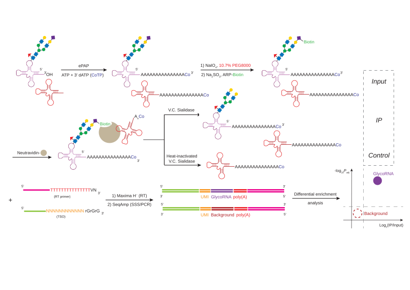
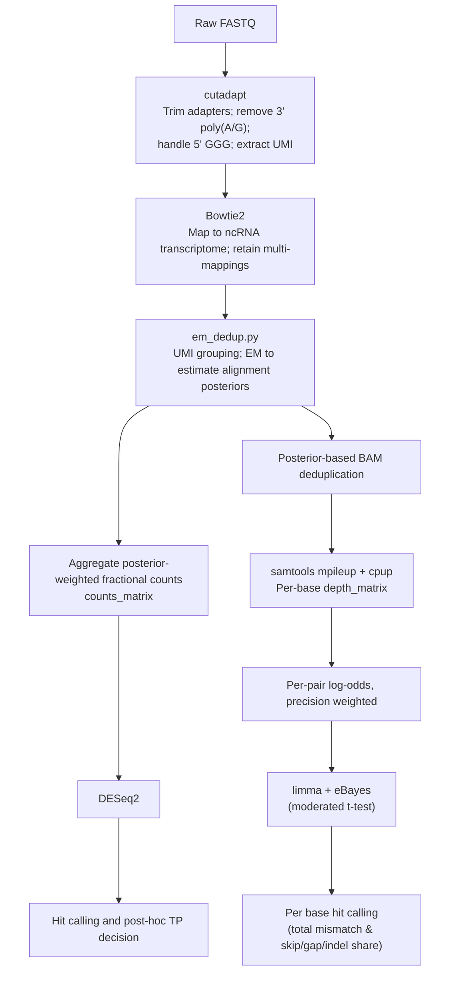

# rPAL-seq
Pipeline for glycoRNA sequencing and analysis

## Overview
This repository contains scripts, reference data and example workflow to reproduce the computational analysis and figures from [Ge, R. et al.](https://doi.org/10.1101/2025.10.04.680438).
rPAL-seq profiles sialoglycoRNA ([Flynn, R.A. et al. *Cell*, 2021](https://doi.org/10.1016/j.cell.2021.04.023)) through chemical conversion, glycan-specific catch and release, followed by optimized small ncRNA library construction (Fig. 1) and a computational analysis pipeline (Fig. 2).

## System requirements

### Software dependencies

Command-line tools:

| tool | version tested |
| --- | --- |
| `python3` | 3.12.2 |
| `R` | 4.3.3 |
| `cutadapt` | 4.9 |
| `bowtie2` | 2.5.4 |
| `samtools` | 1.21 |
| [GNU `parallel`](https://www.gnu.org/software/parallel/) | any recent |
| `cpup` | 0.1 |

GNU `parallel` is used only by the SLURM wrappers in `scripts/workflow/bash/slurm/` to fan out over
samples; the worker scripts themselves do not need it.

R packages: `DESeq2` 1.42.1, `limma` 3.58.1, plus `dplyr`, `readr`, `tidyr`, `stringr`, `purrr`,
`tibble`, `ggplot2`, `ggrepel`, `scales`, `eulerr` and `ComplexUpset` for the plotting scripts.
Python: the standard library plus `pysam` for `umi_em_dedup.py`.

### Operating systems

Developed and run on Linux (x86_64) for the preprocessing steps and on macOS (Apple silicon) for the
R analysis steps. No Windows testing has been done; the bash workflow scripts assume a POSIX shell.
The versions above are the ones the published analysis was run with, not minimum requirements.

### Hardware

No non-standard hardware is required, but the two halves of the pipeline have very different
appetites.

- **Preprocessing** (`scripts/workflow/`) is written for a cluster with a SLURM scheduler. Without
  one, the worker scripts run standalone and a workstation with 8 or more cores and 32 GB of RAM can
  process samples serially. Per-step resource requests are in
  [scripts/workflow/README.md](scripts/workflow/README.md).
- **Analysis** (`scripts/analysis/`) runs comfortably on a laptop: the worked example completes in
  about 10 to 12 seconds on an 8-core machine with 8 GB of RAM.

## Installation

This repository ships no custom package, so there is nothing here to compile or install: the scripts
are run in place. What you do need to install is the third-party dependencies listed above.

```bash
git clone https://github.com/FlynnLab/rPAL-seq.git
cd rPAL-seq
```

The dependencies are most easily obtained with conda/mamba:

```bash
conda create -n rpalseq -c conda-forge -c bioconda \
  python=3.12 r-base=4.3 cutadapt=4.9 bowtie2=2.5.4 samtools=1.21 pysam
conda activate rpalseq
Rscript -e 'if (!requireNamespace("BiocManager", quietly=TRUE)) install.packages("BiocManager", repos="https://cloud.r-project.org"); BiocManager::install(c("DESeq2","limma")); install.packages(c("dplyr","readr","tidyr","stringr","purrr","tibble","ggplot2","ggrepel","scales","eulerr","ComplexUpset"), repos="https://cloud.r-project.org")'
```

`cpup` is the one non-standard tool and is not packaged on conda or CRAN. Install it separately from
[github.com/y9c/cpup](https://github.com/y9c/cpup), following the instructions there, and make sure the
binary is on your `PATH`. It is only needed for the per-base pileup step
(`scripts/workflow/bash/worker/cpup.sh`) and the variant-signature analysis that consumes its output;
the transcript-count arm and the demo run without it.

Typical install time on a normal desktop computer: about 5 minutes for the conda environment and 10
to 20 minutes for the R packages, dominated by compiling the Bioconductor dependencies. Cloning the
repository itself takes seconds.

## Demo

A worked example reproduces the HeLa glycoRNA calls from a 0.2 MB public download, with expected
output and run time, in about 10 to 12 seconds on a laptop. No cluster, alignment index or FASTQ
needed. See **[demo/README.md](demo/README.md)**.

## Repository Structure
```text
repo-root/
├── data/                   # reference files
│   ├── annotation/         # transcript-to-family CSVs
│   ├── manaz_families/     # curated family lists
│   └── transcriptome/      # curated FASTA reference, and the spike-in references
├── scripts/                # pipeline and analysis scripts
│   ├── workflow/           # see scripts/workflow/README.md
│   │   ├── bash/           # preprocessing, alignment, run EM
│   │   └── python/         # EM posterior assignment
│   ├── analysis/
│   │   └── R/              # figure generation, statistics
│   └── revision/           # analyses added during peer review, with their input tables
│       ├── em_benchmark/       # read-assignment benchmark
│       ├── spike_titration/    # synthetic sialoglycoRNA standard, dose-response
│       ├── coverage/           # 5' coverage retention
│       └── classification/     # ROC / LOOCV lineage and EV classification
├── demo/                   # worked example; see demo/README.md
├── doc/                    # workflow diagrams, example output
├── LICENSE
└── README.md
```

## Usage

### How the scripts are parameterized

Every script declares its inputs as literal paths at the top of the file, written as
`/path/to/...` placeholders. Edit those to point at your own data before running; nothing is read
from a config file or the command line. The placeholders you will encounter are
`/path/to/count_matrix.csv`, `/path/to/counts_long.csv`, `/path/to/metadata.csv`,
`/path/to/transcriptome/annotation.csv`, `/path/to/transcriptome.fa`, and for the workflow scripts
`/path/to/workdir`, `/path/to/rPAL-seq/scripts`, `/path/to/bowtie2/index/prefix` and
`/path/to/venv`. Grep for them:

```bash
grep -rn '/path/to/' scripts/
```

Downstream scripts additionally discover their inputs by pattern from the working directory (for
example `list.files(pattern = "^deseq2_results_")`), so run each step from the directory holding the
previous step's output.

`metadata.csv` needs the columns `sample_name`, `group_name`, `replicates` and `plot_name`, where
`sample_name` is the replicate base id **without** the fraction suffix. See
`demo/metadata_demo.csv` for a minimal example.

The SLURM batch scripts in `scripts/workflow/bash/slurm/` submit the workers with a scheduler. Each
worker in `scripts/workflow/bash/worker/` is plain bash and can be run directly instead:

```bash
WORKDIR=/your/workdir bash scripts/workflow/bash/worker/cutadapt.sh sample.fastq.gz
```

### Order of processing

Use index-demultiplexed `fastq.gz` files as the input for `scripts/workflow/`.  
The order of processing is documented in the [paper](https://doi.org/10.1101/2025.10.04.680438) and illustrated in Fig. 2.  

Expected outputs are individual CSV files per library containing:  
1. EM-assigned transcript counts  
2. Per-base pileup results  

Example aggregated data (matrix from multiple samples) can be found under GEO accession `GSE313898`, which includes sequencing runs first deposited under `GSE308686` for the preprint version of this work.

Use the CSV files from the first step as input for `scripts/analysis/`. This identifies enriched hits by DESeq2, enriched mismatches by limma, and generates downstream statistics and plots.

Example volcano plots are available in `doc/`

Analyses added during peer review are in `scripts/revision/`, together with the input tables needed to regenerate each panel. See [`scripts/revision/README.md`](scripts/revision/README.md) for the panel-by-panel map; those scripts follow a different, config-driven convention and are kept separate for that reason.

## Workflow Diagrams

<p align="center">
  
  <br/>
  <em>Figure 1. rPAL-seq workflow. tRNA icon from BioRender.com.</em>
</p>


<p align="center"><em>Figure 2. Computational workflow for rPAL-seq analysis.</em></p>

## License

rPAL-seq is free software: you can redistribute it and/or modify it under the terms of the GNU General
Public License as published by the Free Software Foundation, **either version 3 of the License, or (at
your option) any later version**. The full text is in [LICENSE](LICENSE).

The SPDX identifier is therefore `GPL-3.0-or-later`, an OSI-approved license. GitHub's automatic
detection reports `GPL-3.0` instead: the GPLv3 text is byte-identical whether or not the "any later
version" option is elected, so no tool can infer the election from `LICENSE` alone. It is a statement
by the copyright holder, which is why it is made here rather than left to detection.

There are no restrictions on access or reuse beyond the terms of that license.

## Citing

Please cite both the paper and this software. Citation metadata is in
[CITATION.cff](CITATION.cff); GitHub renders it under **Cite this repository**. Each tagged release is
archived on Zenodo with its own DOI, and the concept DOI
[10.5281/zenodo.21969177](https://doi.org/10.5281/zenodo.21969177) always resolves to the newest
version.
